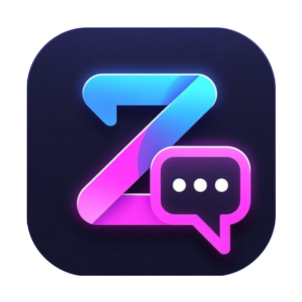
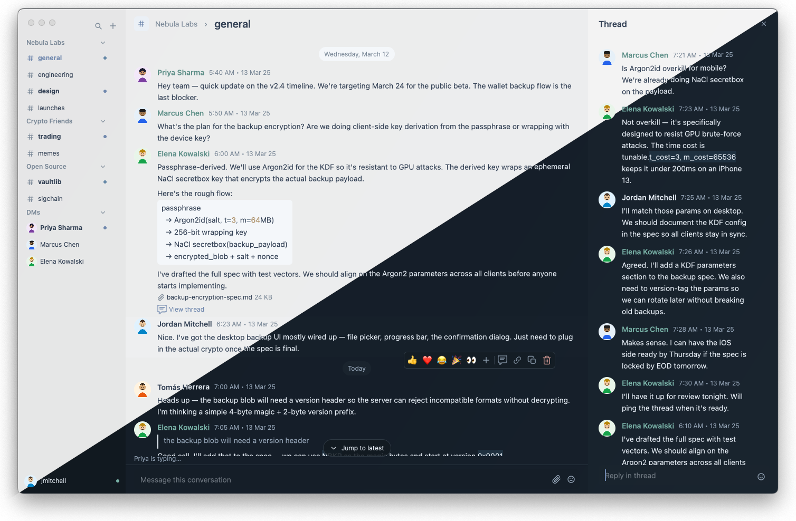

<p align="center">
  
</p>

<h1 align="center">zBase</h1>

<p align="center">
A fast, native desktop chat client for <a href="https://keybase.io">Keybase</a>, built with Rust and <a href="https://gpui.rs">GPUI</a>.
</p>

<p align="center">
  
</p>

zBase is a from-scratch replacement for the official Keybase desktop app. It talks directly to the Keybase daemon over its local msgpack-RPC socket and renders everything through GPUI — the same GPU-accelerated UI framework that powers the [Zed](https://zed.dev) editor. The result is a chat client that launches instantly, scrolls at 120 fps, and uses a fraction of the memory of an Electron app.

## Features

### Chat
- Channels, DMs, and group DMs organized by team/workspace
- Threaded conversations with a dedicated right pane
- Send, edit, and delete messages
- Emoji reactions (standard Unicode and custom team emoji)
- Emoji picker with skin tone preference and recents
- File, image, video, and audio attachments with drag-and-drop upload
- Inline video previews decoded via FFmpeg
- Link previews with thumbnails
- Rich inline markdown: **bold**, *italic*, ~~strikethrough~~, ||spoilers||, `code`, code blocks, and block quotes
- Selectable, copyable message text with styled ranges and clickable links
- @mentions, #channel mentions, and @here/@all broadcasts
- Pinned messages per conversation

### Navigation
- **Quick Switcher** (`Cmd+K`) — fuzzy search across all conversations, ranked by usage affinity
- **Find in Chat** (`Cmd+F`) — search within the current conversation with match-by-match navigation
- **Global Search** (`Cmd+J`) — full-text search across workspaces with filters (by user, channel, has file, has link, mentions me) and highlighted snippets
- **Command Palette** (`Cmd+Shift+P`)
- Keyboard-driven sidebar navigation (`Alt+Up/Down`)
- Back/forward history (`Cmd+[` / `Cmd+]`)
- Jump to recent conversations (`Cmd+1` through `Cmd+5`)
- Deep link support (`keybase://chat/...`)

### User Profiles
- Avatars, bio, location, and title
- Identity proofs (Twitter, GitHub, etc.) with verification state
- Social graph — followers and following with follow/unfollow
- Team showcase
- Presence indicators (active, away, do not disturb, offline) with status text


### Preferences
- Light, dark, and system-follow theme modes
- Comfortable and compact density
- Reduced motion toggle
- Per-account sidebar section ordering and collapse state
- Persistent settings stored in `.zbase/settings.conf`

### Performance
- Built-in benchmark harness (`Cmd+Shift+B`) with per-component timers (render, sidebar, main panel, composer, reducer, backend events)
- CSV export and configurable scenarios via environment variables
- RocksDB local cache for offline-ready conversation and message history
- Tantivy full-text search index with automatic schema migration

## Requirements

- **macOS 13+** (Apple Silicon or Intel)
- **Rust 2024 edition** (nightly toolchain recommended)
- **Keybase** daemon running locally (`keybase service` or the Keybase app)
- **FFmpeg** libraries (for video preview decoding)
- **CMake** and **pkg-config** (build dependencies for RocksDB)

## Install

### Homebrew

```sh
brew install cameroncooper/tap/zbase
```

Homebrew builds from source, so this will take a few minutes. Once it finishes, link the app bundle into your Applications folder:

```sh
ln -sf "$(brew --prefix)/opt/zbase/zBase.app" /Applications/zBase.app
```

### From source

```sh
git clone https://github.com/cameroncooper/zbase.git
cd zbase
cargo build --release
```

To create a macOS `.app` bundle:

```sh
scripts/macos/build_app_bundle.sh release
cp -r dist/macos/zBase.app /Applications/
```

## Usage

Make sure the Keybase daemon is running, then launch zBase:

```sh
# Run from the terminal
cargo run --release

# Or launch the app bundle
open /Applications/zBase.app
```

### Environment variables

| Variable | Description |
|---|---|
| `ZBASE_LOG_LEVEL` | Logging verbosity: `trace`, `debug`, `info`, `warn`, `error` |
| `ZBASE_BENCH_AUTOSTART` | Start the performance benchmark automatically on launch |
| `ZBASE_BENCH_DURATION_SECS` | Benchmark capture duration |
| `ZBASE_BENCH_SCENARIO` | Benchmark scenario name |
| `ZBASE_BENCH_LABEL` | Label for the benchmark run |
| `ZBASE_BENCH_OUTPUT` | Path for benchmark CSV output |

### Keyboard shortcuts

| Shortcut | Action |
|---|---|
| `Cmd+K` | Quick Switcher |
| `Cmd+J` | Global Search |
| `Cmd+F` | Find in Chat |
| `Cmd+N` | New Chat |
| `Cmd+Shift+P` | Command Palette |
| `Cmd+1` | Home |
| `Cmd+2–5` | Recent conversations |
| `Cmd+[` / `Cmd+]` | Navigate back / forward |
| `Cmd+Shift+\` | Toggle thread pane |
| `Cmd+Shift+M` | Toggle members pane |
| `Cmd+Shift+D` | Toggle details pane |
| `Cmd+Shift+F` | Files pane |
| `Cmd+Shift+A` | Activity |
| `Cmd+,` | Preferences |
| `Alt+Up/Down` | Move sidebar selection |
| `Escape` | Dismiss overlays |

## Architecture

```
src/
├── app/          # Bootstrap, window management, theme, key bindings
├── domain/       # Core types: messages, conversations, users, profiles
├── models/       # View models (sidebar, timeline, composer, search, settings, …)
├── state/        # Unidirectional store: actions → reducer → state → effects
├── services/     # Backend adapters, RocksDB cache, Tantivy search, sync, uploads
│   └── backends/
│       └── keybase/  # Keybase RPC client and adapter
├── util/         # Fuzzy matching, video decoder, deep links, debounce, perf harness
├── views/        # GPUI components (sidebar, timeline, composer, overlays, profile, …)
└── main.rs
```

The backend layer is trait-based (`ChatBackend`), making it possible to add adapters for other chat providers in the future.

## Development tools

- **`keybase_rpc_inspect`** — standalone binary for inspecting live Keybase RPC traffic:
  ```sh
  cargo run --bin keybase_rpc_inspect
  ```
- **Keybase Inspector** (`Cmd+Shift+I`) — in-app RPC debug panel

## License

MIT
